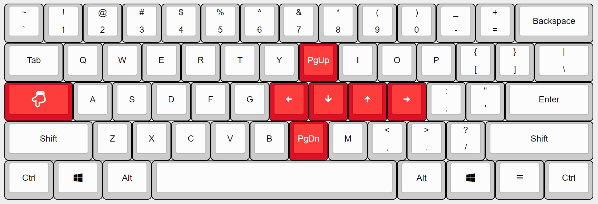
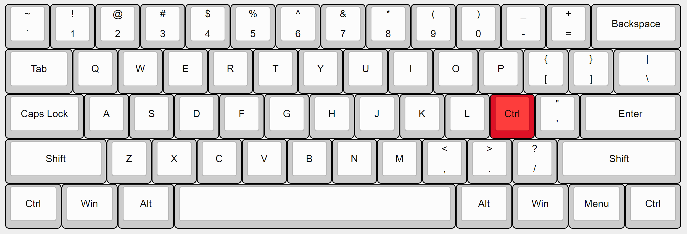

键盘增强
========

**解开键盘封印，释放生产力**。在不改变你原有的打字习惯下，提升敲键盘的效率，特别是提升写代码的效率。

最近在设计一个60%的键盘，于是花了些时间了解很多键盘的设置，比如[TMK](https://github.com/tmk/tmk_keyboard)里面的Layers设计、[Toward a more useful keyboard](https://github.com/jasonrudolph/keyboard)中通过组合键尽量让手停留在<kbd>A</kbd><kbd>S</kbd><kbd>D</kbd><kbd>F</kbd>、<kbd>H</kbd><kbd>J</kbd><kbd>K</kbd><kbd>L</kbd>。

对于普通的键盘，通过`长按(long press)`、`组合键`和`层(layer)`这3个，即可实现强大的功能。

+ 长按<kbd>CapsLock</kbd>触发新的一层，新层中<kbd>H</kbd><kbd>J</kbd><kbd>K</kbd><kbd>L</kbd>映射为方向键<kbd>←</kbd><kbd>↓</kbd><kbd>↑</kbd><kbd>→</kbd>

+ 长按<kbd>;</kbd>映射为<kbd>Ctrl</kbd>，则

  + <kbd>;</kbd> + <kbd>c</kbd> = <kbd>Ctrl</kbd> + <kbd>c</kbd>
  + <kbd>;</kbd> + <kbd>v</kbd> = <kbd>Ctrl</kbd> + <kbd>v</kbd>
  + <kbd>;</kbd> + <kbd>x</kbd> = <kbd>Ctrl</kbd> + <kbd>x</kbd>
  + <kbd>;</kbd> + <kbd>a</kbd> = <kbd>Ctrl</kbd> + <kbd>a</kbd>

其中，短按<kbd>CapsLock</kbd>或<kbd>;</kbd>仍是原来的功能，唯一的副作用是长按<kbd>;</kbd>输出一长串`;`的重发(repeat)功能没有了，不过长按<kbd>;</kbd>相对不常用。

在Windows中，我们可以用AutoHotKey脚本实现以上功能，详见[keyboard.ahk](keyboard.ahk)。

## 安装
1. 下载安装[AutoHotKey](https://www.autohotkey.com/)
2. <kbd>Win</kbd>+<kbd>r</kbd>输入` C:\ProgramData\Microsoft\Windows\Start Menu\Programs\Startup`打开文件夹，把[keyboard.ahk](keyboard.ahk)放进去，让这个AutoHotKey脚本可以在开机时自启动

## 参考
+ [TMK](https://github.com/tmk/tmk_keyboard)
+ [Toward a more useful keyboard](https://github.com/jasonrudolph/keyboard)
